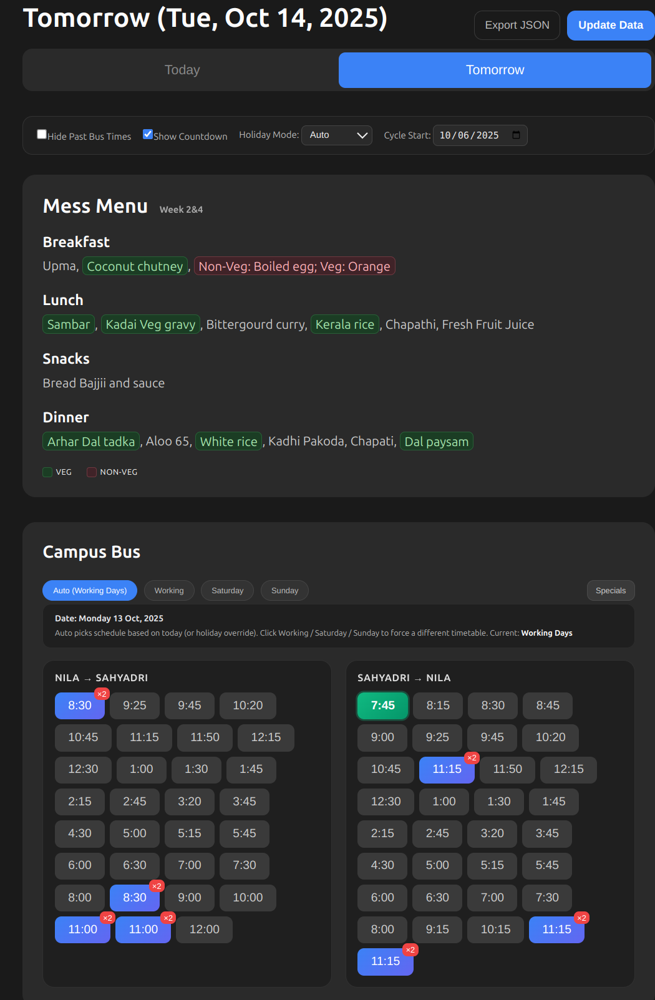
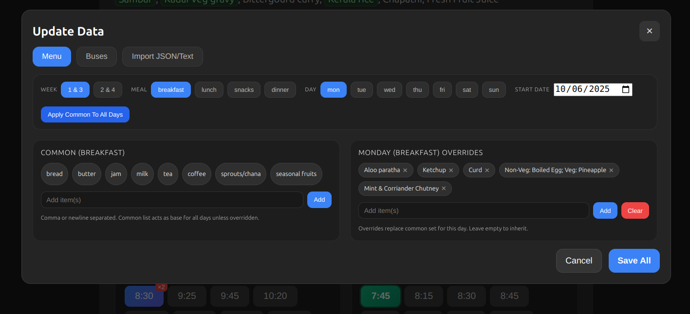

# Campus Dashboard 🎓

A modern, feature-rich React dashboard for managing campus mess menus and bus schedules. Built with a sleek dark UI and intuitive data management capabilities.

## ✨ Features

### 🍽️ Advanced Menu Management
- **4-Week Cycle System**: Supports alternating weekly menus (Week 1&3, Week 2&4)
- **Chip-Based Editor**: Add, remove, and manage menu items with an intuitive chip interface
- **Common vs Override System**: Set common meals for all days with per-day overrides
- **Veg/Non-Veg Detection**: Automatic categorization and color coding of food items
- **Real-time Updates**: Changes reflect immediately in the main dashboard

### 🚌 Smart Bus Schedule Management
- **Category-Based Scheduling**: Separate schedules for Working Days, Saturday, and Sunday
- **Next Bus Highlighting**: Real-time highlighting of the next available bus
- **Time Format Intelligence**: Automatic AM/PM detection and 24-hour support
- **Manual Category Override**: Force different timetables regardless of day
- **Special Routes**: Support for Palakkad Town and Wise Park Junction routes

### 🎨 Modern User Interface
- **Dark Theme**: Easy on the eyes with a professional dark interface
- **Responsive Design**: Works seamlessly on desktop, tablet, and mobile devices
- **Tabbed Navigation**: Clean organization with Menu, Buses, and Import tabs
- **Real-time Clock**: Live IST time display with countdown timers
- **Visual Indicators**: Color-coded chips, badges, and status indicators

## 🖼️ Screenshots

### Today's Dashboard View


The main dashboard showing today's mess menu and bus schedules with real-time features:
- Current day's menu with week indicator (Week 2&4)
- Veg/Non-veg color coding for food items
- Live bus timings with next bus highlighting
- Category-based bus schedule display
- Auto schedule detection with manual override options

### Tomorrow's Dashboard View  


Tomorrow view demonstrating the day-switching functionality:
- Seamless navigation between today and tomorrow
- Consistent menu and bus schedule layout
- Real-time countdown and next bus indicators
- Category tabs for different bus schedules
- Special routes section for additional services

### Advanced Data Update Interface


The comprehensive data management system featuring:
- **Menu Tab**: Chip-based menu editor with week/meal/day navigation
- **Buses Tab**: Category management for different schedule types  
- **Import Tab**: JSON and text import capabilities
- **Week Selection**: Toggle between Week 1&3 and Week 2&4
- **Common vs Override System**: Base items with day-specific customizations
- **Real-time Preview**: Changes reflect immediately
- **Bulk Operations**: Apply common items to all days at once

## 🚀 Getting Started

### Prerequisites
- Node.js 14+ 
- npm or yarn package manager

### Installation

1. **Clone the repository**
   ```bash
   git clone https://github.com/ChakradharReddy3237/Campus---Mess-bus-info.git
   cd Campus---Mess-bus-info
   ```

2. **Install dependencies**
   ```bash
   npm install
   ```

3. **Start the development server**
   ```bash
   npm start
   ```

4. **Open your browser**
   Navigate to [http://localhost:3000](http://localhost:3000)

## 📊 Data Management

### Using the Update Data Interface

The application features a comprehensive data management system accessible through the **"Update Data"** button in the header.

#### Menu Tab
- **Week Selection**: Choose between Week 1&3 or Week 2&4
- **Meal Focus**: Switch between breakfast, lunch, snacks, and dinner
- **Day Navigation**: Edit specific days (Monday through Sunday)
- **Common Items**: Set base menu items that apply to all days
- **Override System**: Add day-specific items that replace common items
- **Bulk Operations**: Apply common items to all days at once

#### Buses Tab  
- **Category Management**: Separate schedules for working days, Saturday, and Sunday
- **Route Direction**: Nila → Sahyadri and Sahyadri → Nila
- **Time Management**: Add, remove, and sort bus timings
- **Special Routes**: Configure Palakkad Town and Wise Park Junction services
- **Validation**: Automatic time format validation and sorting

#### Import JSON/Text Tab
- **JSON Import**: Import complete data structures
- **Text Parsing**: Parse formatted text data
- **Multi-format Support**: Handles various input formats

### JSON Structure

The application uses structured JSON files in `public/data/`:

**menuCycle.json** - 4-week menu cycle:
```json
{
  "type": "4-week",
  "startDate": "2025-10-06",
  "weeks": {
    "week13": {
      "common": {
        "breakfast": "bread, butter, jam, milk, tea, coffee",
        "lunch": "rice, dal, vegetable curry, pickle"
      },
      "days": {
        "monday": {
          "breakfast": "Aloo Paratha, Curd"
        }
      }
    }
  }
}
```

**busSchedule.json** - Category-based bus schedules:
```json
{
  "categories": {
    "working": {
      "routes": {
        "Nila → Sahyadri": ["8:30", "9:25", "10:20"],
        "Sahyadri → Nila": ["7:45", "8:15", "9:00"]
      }
    }
  },
  "specials": {
    "palakkadTown": ["Route descriptions..."],
    "wisePark": ["Route descriptions..."]
  }
}
```

## 🛠️ Technical Features

### Frontend Technologies
- **React 18**: Modern functional components with hooks
- **CSS Grid & Flexbox**: Responsive layout system
- **Local Storage**: Persistent data storage
- **Real-time Updates**: Live clock and countdown timers
- **Component Architecture**: Modular, reusable components

### Key Components
- `AdvancedMenuEditor`: Chip-based menu editing interface
- `CampusBus`: Smart bus schedule display with real-time features
- `DataUpdateModal`: Unified data management interface
- `MessMenu`: Menu display with veg/non-veg categorization

### Data Processing
- **Time Intelligence**: Automatic AM/PM detection and 24-hour conversion
- **Menu Categorization**: Automatic veg/non-veg food item detection
- **Cycle Management**: 4-week rotating menu system
- **Validation**: Input validation and error handling

## 🎯 Usage Examples

### Adding Menu Items
1. Click "Update Data" → "Menu" tab
2. Select week, meal, and day
3. Add items to "Common" section for all days
4. Add items to specific days for overrides
5. Use "Apply Common To All Days" for bulk operations

### Managing Bus Schedules
1. Click "Update Data" → "Buses" tab  
2. Select category (Working/Saturday/Sunday)
3. Choose route direction
4. Add times using the input field
5. Remove times by clicking the × on chips

### Viewing Live Data
- **Next Bus**: Highlighted in green with countdown timer
- **Current Menu**: Automatically shows today's meals based on cycle
- **Real-time Clock**: IST time display with live updates
- **Category Auto-detection**: Automatically selects appropriate bus schedule

## 🏗️ Development

### Build Commands
```bash
# Install dependencies
npm install

# Start development server
npm start

# Build for production  
npm run build

# Run tests
npm test
```

### Project Structure
```
src/
├── components/           # React components
│   ├── AdvancedMenuEditor.js
│   ├── CampusBus.js
│   ├── DataUpdateModal.js
│   └── MessMenu.js
├── utils/               # Utility functions
│   ├── busParser.js
│   ├── parser.js
│   └── storage.js
└── App.js              # Main application component

public/
└── data/               # JSON data files
    ├── menuCycle.json
    └── busSchedule.json
```

## 🤝 Contributing

1. Fork the repository
2. Create a feature branch (`git checkout -b feature/amazing-feature`)
3. Commit your changes (`git commit -m 'Add amazing feature'`)
4. Push to the branch (`git push origin feature/amazing-feature`)
5. Open a Pull Request

## 📝 License

This project is licensed under the MIT License - see the [LICENSE](LICENSE) file for details.